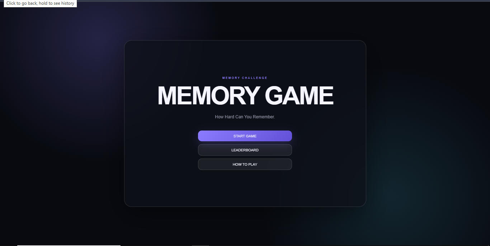

# MEMORY GAME
 
Hi! I am Hrishikesh, a curious mind.this is a small recreation of a game which is used to lay with my cousins. its the game where the card reveals it by clicking and and you should make a pair, if the air is wrong the card hiddes it self and you have to remember them
This is designed in one of my faourite theme- dark glassmorphism

## Screenshots
 

 

 
## Getting Started
 Demo: [https://hrishikesh599.github.io/](https://hrishikesh599.github.io/memory-game/)
### Dependencies
 
* this is a basic static webpage, nothing to install here!!
* Any basic browser will do the job
 
### Executing program
* if your thinking how to run, just double click the index.html file, that's it
## Help
 
* if you are running it locally, and the font seems off, it might be because you have no internet or it slow, fonts needed to load.
* and if the pages seems of in animation, maybe some setting in your browser might block it, ensure it is not!
 
## License
 
This project is licensed under the MIT License - see the LICENSE.md file for details
 
